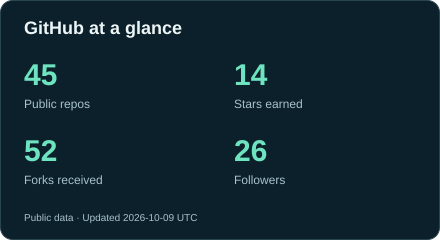
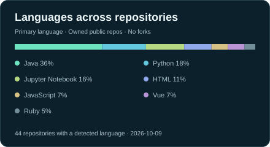

<h1 align="center">Camilo Andrés Castañeda Galindo</h1>

  <b>Systems Engineer · Software Developer · Project Management</b> 
  MSc Student in Artificial Intelligence · Research interests in GeoAI &amp; Remote Sensing 
  Ibagué, Colombia · GitHub: <a href="https://github.com/ciaocamilo">@ciaocamilo</a>

  

  <a href="https://www.linkedin.com/in/camilocastanedagalindo">LinkedIn</a> ·
  <a href="https://scholar.google.com/citations?user=qGKkld8AAAAJ&amp;hl=en">Google Scholar</a> ·
  <a href="https://www.researchgate.net/profile/Camilo-Andres-Castaneda-Galindo-2">ResearchGate</a> ·
  <a href="https://github.com/ciaocamilo?tab=repositories">Repositories</a>

## About Me / Professional Profile

I'm **Camilo Andrés Castañeda Galindo**, known on GitHub as **ciaocamilo**, a **Systems Engineer and Software Developer** based in Ibagué, Colombia. I have **10+ years of combined experience** in software development, technology project coordination and education, and a specialization in **Project Management**. My development work includes web applications, APIs and databases, using technologies such as Ruby on Rails, Python, JavaScript, Vue.js and PostgreSQL.

I'm currently pursuing a **master's degree in Artificial Intelligence**, with interests in **GeoAI (geospatial artificial intelligence), Remote Sensing and deep learning**. I enjoy learning across disciplines, building software and sharing programming knowledge.

**En español:** Ingeniero de sistemas, desarrollador de software y especialista en Gerencia de Proyectos, con más de diez años de experiencia combinada en desarrollo, coordinación tecnológica y docencia. Estudiante de Maestría en Inteligencia Artificial, con interés en GeoAI, teledetección y aprendizaje profundo.

<b>Más sobre mi perfil en español</b>

Mi trayectoria combina la construcción de aplicaciones web y APIs, el trabajo con bases de datos y la coordinación de proyectos tecnológicos. En docencia, me interesa ayudar a comprender la lógica de programación y la resolución de problemas.

Disfruto aprender sobre inteligencia artificial, ciencias de la Tierra y astronomía, y explorar nuevas herramientas de desarrollo y análisis de datos.

## Selected projects

### 01 / [Tolima Sísmico — seismic data analysis in Colombia](https://github.com/ciaocamilo/Sismos-Tolima-Aplicacion-web-analisis)
**Earth science · Interactive data application**

An interactive application for exploring earthquakes in Tolima, Colombia, with maps, temporal analysis and spatial clustering using Colombian Geological Survey (SGC) data.

`Python` `Dash` `Plotly` `Folium` `scikit-learn`

[Open the Tolima Sísmico application](https://sismos-tolima-aplicacion-web.onrender.com/)

### 02 / [Cookie quality inspection — computer vision with OpenCV](https://github.com/ciaocamilo/control-calidad-galletas-vision-artificial)
**Computer vision · Academic project**

Inspect cookies from a live webcam feed using classical image processing. The project combines Otsu thresholding, morphological operations and contour detection, then uses circularity to distinguish intact cookies from broken ones.

`Python` `OpenCV` `NumPy` `Image processing`

### 03 / [Traffic forecasting — ARIMA and LSTM time-series models](https://github.com/ciaocamilo/prediccion-trafico-arima-lstm)
**Deep learning · Academic project**

Compare statistical and neural approaches to hourly traffic forecasting. The notebook documents chronological train/validation/test splits, seasonal baselines and peak-hour error analysis, alongside data-quality checks and model limitations.

`Python` `TensorFlow / Keras` `statsmodels` `Time series`

### 04 / [Transformers for technical support — practical model evaluation](https://github.com/ciaocamilo/M-S2-AP2-Actividad_5_Transformers_SoporteTecnico)
**Natural language processing · Academic project**

Evaluate pretrained models on controlled Spanish-language support scenarios: sentiment analysis, zero-shot ticket classification, summarization and technical translation. The project documents failure cases and compares abstractive summaries with an extractive approach based on sentence embeddings.

`Python` `Hugging Face Transformers` `PyTorch` `NLP`

### Creative coding / [ERS: Elefantes rosados en la ciudad](https://github.com/ciaocamilo/ERS-AI-Test)
**Browser-based 3D · Interactive game**

Fly a pink elephant through a 3D city and collect seven stars that change location on each restart. Includes keyboard and touch controls, guidance to the nearest star, sound rewards and an original synthesized soundtrack.

`JavaScript` `Three.js` `WebGL`

[Play ERS — Elefantes rosados en la ciudad](https://elefante-en-el-aire.ciaocamilo.chatgpt.site/)

<b>More projects: supervised learning, clustering and fuzzy logic</b>

| Project | What it explores |
| :--- | :--- |
| [Rain prediction in Australia](https://github.com/ciaocamilo/clasificacion-clima-australia) | Regularized logistic regression and Gaussian Naive Bayes for next-day rainfall classification. |
| [Water quality clustering](https://github.com/ciaocamilo/aprendizaje-no-supervisado-calidad-agua) | PCA, K-Means and Gaussian mixture models applied to physicochemical water measurements. |
| [MIO bus speed prediction](https://github.com/ciaocamilo/ml-regresion-transporte-mio) | Linear regression and Random Forest applied to transport data from Cali, Colombia. |
| [Birth forecasting in Colombia](https://github.com/ciaocamilo/M-S1-AP1-Prediccion-nacimientos-machine-learning) | Regression and time-series models applied to DANE birth records. |
| [Fuzzy inference with Python](https://github.com/ciaocamilo/M-S1-FIA-Logica-Difusa) | An academic Mamdani inference system using membership functions and rule-based reasoning. |

## Tools I work with

| Area | Technologies |
| :--- | :--- |
| **Software development** | Ruby on Rails · Python · Java · JavaScript · Vue.js |
| **Data & databases** | PostgreSQL · SQL · MongoDB · PostGIS |
| **Engineering workflow** | Git · Linux · Docker · Nginx · RSpec |
| **Machine learning & data analysis** | pandas · scikit-learn · TensorFlow / Keras · statsmodels |
| **Computer vision & NLP** | OpenCV · Hugging Face Transformers · PyTorch |
| **Geospatial interests & tools** | Google Earth Engine · QGIS · Remote sensing |

## Interests & Academic Profiles

My interests span **artificial intelligence, GeoAI, remote sensing and data analysis**. I value curiosity, interdisciplinary learning and the exchange of ideas between software engineering and science.

Academic profiles: [Camilo Andrés Castañeda Galindo on Google Scholar](https://scholar.google.com/citations?user=qGKkld8AAAAJ&hl=en) · [ResearchGate profile](https://www.researchgate.net/profile/Camilo-Andres-Castaneda-Galindo-2).

**Beyond code:** astronomy, Earth science, environmental conservation and education.

## GitHub at a glance

  
  

Public repositories only. Language percentages describe repository counts, not proficiency or coding time.

---

<b>Let's connect around software, science and meaningful applications of AI.</b> 
<a href="https://www.linkedin.com/in/camilocastanedagalindo">Connect with Camilo on LinkedIn →</a>

